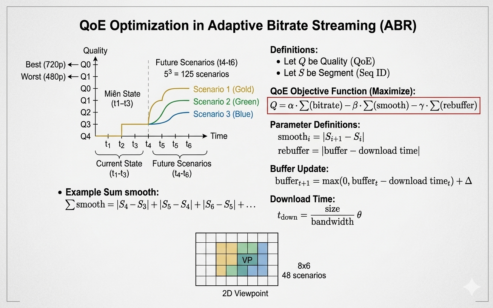

# MPC Algorithm for Adaptive Bitrate Streaming

## Description

This project implements a Model Predictive Control (MPC) algorithm for adaptive bitrate (ABR) selection in video streaming. When a video is stored on a server, it is not transmitted entirely all at once. It is divided into many short pieces called **Segments** (e.g., 2 or 4 seconds long). Each segment is encoded and stored at multiple quality levels and resolutions. The task of this client-side ABR algorithm is to decide at which bitrate to download the *i*-th segment before the download begins.

The algorithm aims to optimize the Quality of Experience (QoE) by predicting future network conditions and selecting the best bitrate sequence over a lookahead horizon using a depth-first search (DFS) approach.


## Overall Architecture

The ABR Video Streaming System utilizes a closed-loop data flow spanning from Server to Client. It consists of three main components:

1. **Server-side (Video Preparation)**: When an original video is available, multimedia processing software (like FFmpeg) "chops" the video into small segments and encodes them into various resolutions/bitrates (e.g., 480p, 720p, 1080p).
2. **Network Communication (Transmission Channel)**: Serves as a bridge between the Server and the Client. The Client uses the HTTP protocol (e.g., via network libraries like `libcurl` or `curl`) to continuously send requests to pull down each small video segment.
3. **Client-side (Video Player)**: The "brain" of the application where the MPC algorithm operates:
   - **Bandwidth Estimation**: Continuously measures the network speed to determine if it is fast or slow.
   - **Buffer**: Stores downloaded segments that haven't been played yet. Its state (filling up or near depletion) is continuously monitored.
   - **MPC Controller**: Takes the predicted bandwidth and current buffer state to calculate the optimal quality for the next segment.
   - **Request**: Generates the HTTP request to fetch the specific segment and places it into the buffer.

## Features

- **QoE Optimization**: Balances video quality, bitrate changes, and rebuffering penalties using a configurable QoE metric.
- **Lookahead Prediction**: Considers future segments (configurable steps) to make informed decisions.
- **Configurable Parameters**: Easily adjustable constants for QoE weights, segment duration, and available bitrates.
- **Simulation Mode**: Includes a simulation with predefined bandwidth traces to demonstrate the algorithm's behavior.

## Algorithm Overview

### 1. Objective Function: Optimizing User Experience


The algorithm seeks to maximize the Quality of Experience (QoE) defined by the following equation:

`Q = α × ∑(bitrate) - β × ∑(smoothness) - γ × ∑(rebuffer)`

- **Reward (Greedy)**: `α × ∑(bitrate)` - The higher the chosen quality, the more points the system achieves.
- **Lag Penalty (Fear 1)**: `γ × ∑(rebuffer)` - Choosing high quality in weak networks depletes the buffer, causing video freeze (rebuffering). This is the heaviest penalty in the viewing experience.
- **Fluctuation Penalty (Fear 2)**: `β × ∑(smoothness)` - Continuous bitrate changes between consecutive segments (`|S[i+1] - S[i]|`) cause visual discomfort, resulting in point deductions.

### 2. The Heart of the System: Buffer State (The Model)

The "Model" in MPC represents how the system simulates changes in the Buffer over time. The buffer is updated after downloading a new segment using the following mathematical formula:

`B_next = max(0, B_current - t_download) + t_segment`

- `B_current`: Amount of video (in seconds) currently available but not yet played.
- `t_download`: Actual time spent downloading the segment (`Segment Size / Network Bandwidth`). The player continuously "consumes" video during this time.
- `t_segment`: Duration of the newly downloaded video segment (e.g., 4 seconds).
*Note: If `t_download > B_current`, the buffer is exhausted and drops to 0, causing a freeze/rebuffer. The system does not allow a negative buffer.*

### 3. The Flow of the MPC Algorithm (Step-by-Step)

Unlike simple greedy algorithms, MPC calculates *K* steps ahead but only executes 1 step. Assuming a lookahead window of *K=5* future segments, the procedure unfolds as follows:

1. **Bandwidth Estimation**: Evaluate download speed history to forecast the network bandwidth for the next 5 segments.
2. **Scenario Generation**: Simulate all possible scenario branches that could occur in the next 5 steps.
3. **Calculation and Future Simulation**: For each scenario, use the Buffer Model and Predicted Bandwidth to calculate depletion/fill states at each step. Apply the QoE function to score the entire scenario.
4. **Decision Making (The Control)**: Compare the QoE scores of all branches and select the scenario that yields the highest *Q* value.
5. **Execution and Receding Horizon**: Extract *only the first decision* of the winning scenario to send the HTTP Request. After downloading, update the actual state and repeat the entire 5-step prediction process from the beginning.

## Requirements

- C compiler (e.g., GCC)
- Standard C libraries: `stdio.h`, `stdlib.h`, `math.h`

## Compilation and Usage

### Compilation

Compile the program using GCC:

```bash
gcc -o mpc mpc.c -lm
```

The `-lm` flag is required to link the math library for functions like `fmax` and `abs`.

### Usage

Run the compiled executable:

```bash
./mpc
```

The program will simulate the MPC algorithm over 8 video segments with predefined bandwidth conditions and print the decisions and buffer states for each segment.

## Example Output

```
MPC Algorithm
Current [Segment 1] Buffer: 0.00s
  -> [Network Prediction: 4000 kbps] MPC decide to choose: 3000 kbps
  -> Installed 1.50s. Updated Buffer : 0.50s

Current [Segment 2] Buffer: 0.50s
  -> [Network Prediction: 3500 kbps] MPC decide to choose: 3000 kbps
  -> Installed 1.71s. Updated Buffer : 0.79s

...
```

## Configuration

Key parameters can be modified in the source code:

- `ALPHA`, `BETA`, `GAMMA`: QoE weights
- `SEGMENT_DURATION`: Duration of each video segment in seconds
- `AVAILABLE_BITRATES`: Array of available bitrate options
- `LOOKAHEAD_STEPS`: Number of future segments to consider
- Bandwidth array in `main()`: Simulated network conditions

## Limitations

- This is a simplified simulation and does not include real-time network monitoring or actual video playback.
- The DFS approach may not scale well for larger lookahead windows or more bitrate options.
- Assumes perfect bandwidth prediction; in practice, prediction accuracy would affect performance.

## Contributing

Feel free to submit issues or pull requests for improvements, bug fixes, or extensions.

## License

This project is provided as-is for educational and research purposes.